# GlobalAzure-2025
Fotos e informações gerais sobre o evento "Global Azure 2025", realizado em 09/05/2025 na cidade de São Paulo-SP.

Organizadores:
- **Renato Groffe (Microsoft MVP, Docker Captain, APISec U Ambassador, MTAC)**
- **Thiago Bertuzzi (Microsoft MVP, APISec U Ambassador)**
- **Milton Camara Gomes (Microsoft MVP, MTAC)**

Número de participantes: **36 pessoas**

---

Apresentações/painéis que aconteceram durante o evento:

_# Keynote: Global Azure 2025 em São Paulo-SP_

Apresentadores:
- Renato Groffe (Microsoft MVP, Docker Captain, APIsec U Ambassador, MTAC)
- Thiago Bertuzzi (Microsoft MVP, APIsec U Ambassador)

Tecnologias e tópicos abordados: **Microsoft Azure, .NET, ASP.NET Core, Containers, Docker, Kubernetes, Azure OpenAI, GitHub Copilot, Cybersecurity, DevSecOps...**

_# Armadilhas Invisíveis: Protegendo Aplicações de AI contra Vetores de Ataque Emergentes_

Palestrante: Erick Ferreira (Microsoft)

Tecnologias e tópicos abordadas: **Cybersecurity, Microsoft Azure, Azure OpenAI**

_# Interpretando Documentos com Azure Document Intelligence + Azure Open AI_

Palestrantes:
- Beatriz Tavernaro (Microsoft Learn Student Ambassador)
- Marcio Nizzola (Microsoft MVP)

Tecnologias e tópicos abordados: **Azure Open AI, Document Intelligence, Azure AI Services**

_# O Futuro da Nuvem com Azure: Inovação, IA e Segurança!_

Participantes:
- Renato Groffe (Microsoft MVP, Docker Captain, APIsec U Ambassador, MTAC)
- Thiago Bertuzzi (Microsoft MVP, APIsec U Ambassador)
- Mayumi Shingaki (Microsoft MVP)
- Milton Camara Gomes (Microsoft MVP, MTAC)

Tecnologias e tópicos abordados: **Microsoft Azure, .NET, ASP.NET Core, Containers, Docker, Kubernetes, Azure OpenAI, GitHub Copilot, Cybersecurity, OWASP, Azure DevOps, GitHub Actions, DevSecOps...**

---

Acesse este [**link**](/img/) para visualizar todas as fotos das apresentações.

Para acessar a gravação do evento no **YouTube** clique neste [**link**](https://www.youtube.com/watch?v=17hknH1POTI).

Este evento foi uma parceria entre as comunidades [**.NET SP**](https://www.meetup.com/dotnet-Sao-Paulo/), [**Azure Talks**](https://www.meetup.com/azure-talks/), [**Azure na Prática**](https://www.youtube.com/azurenapratica) e o [**Microsoft Reactor**](https://www.meetup.com/Microsoft-Reactor-Sao-Paulo/).

Formulário utilizado para inscrições: [**Microsoft Reactor**](https://developer.microsoft.com/en-us/reactor/events/25575/)

Local: Microsoft Reactor - Rua Jaceru, 225 - Vila Gertrudes - São Paulo - SP - CEP: 04705-000

Deixamos aqui nossos agradecimentos ao Victor Temple e à Larissa Cyganski pela oportunidade e todo o apoio para promovermos esta edição local do .NET Conf no Microsoft Reactor em São Paulo-SP.

---

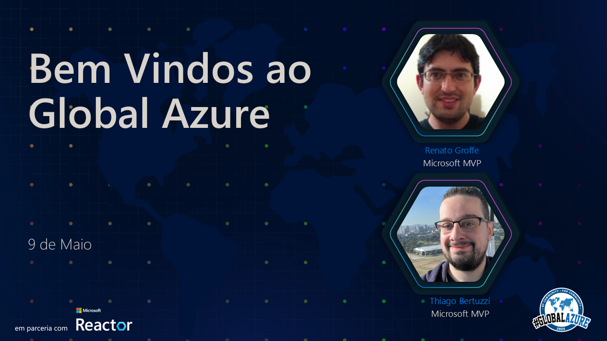

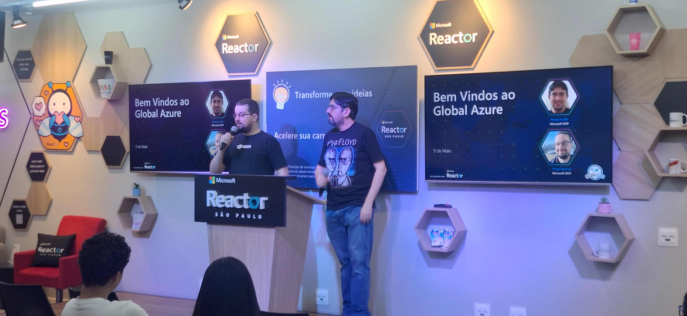

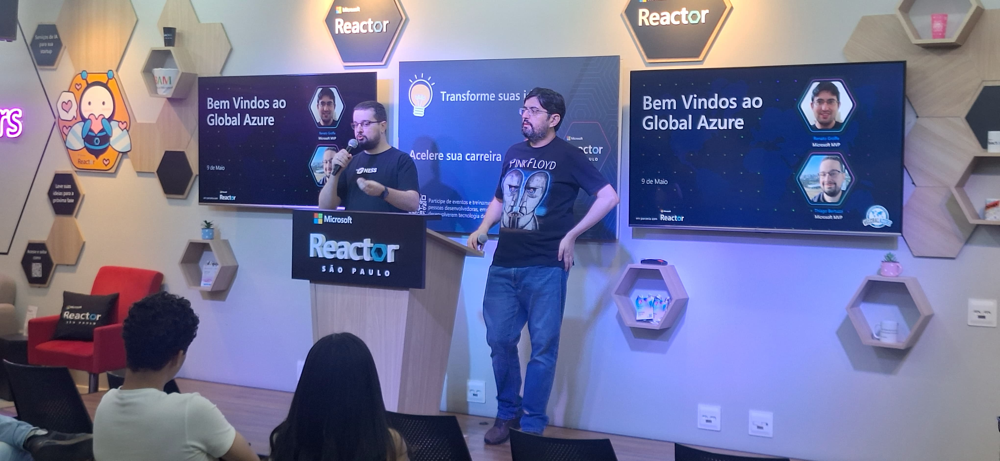

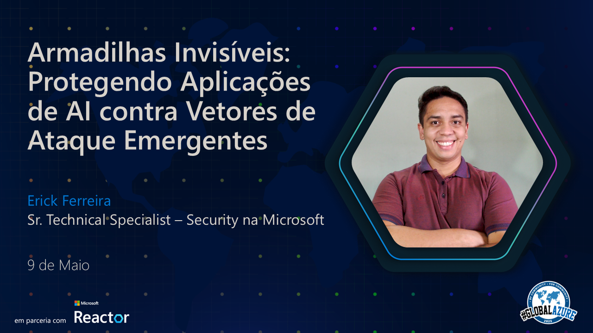

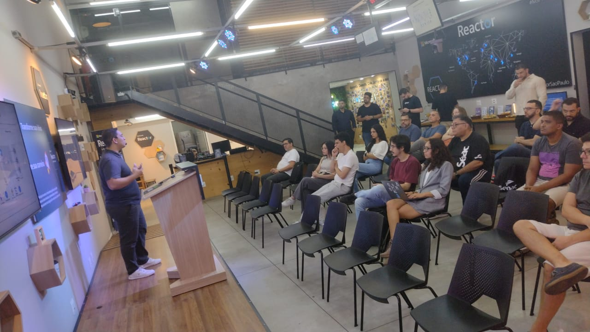

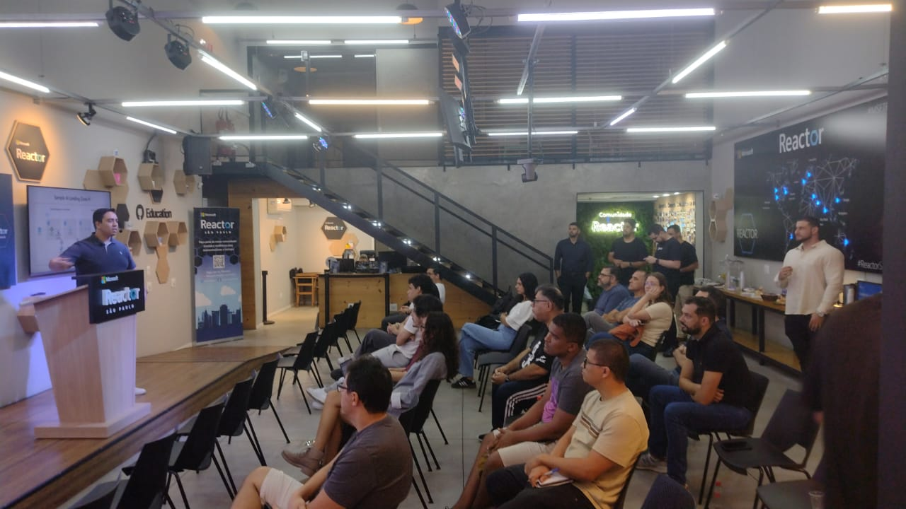

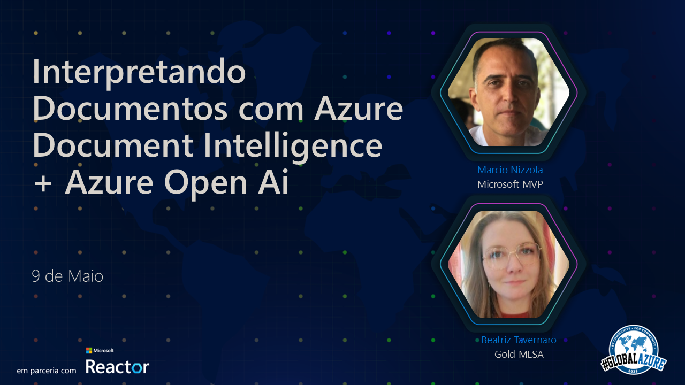

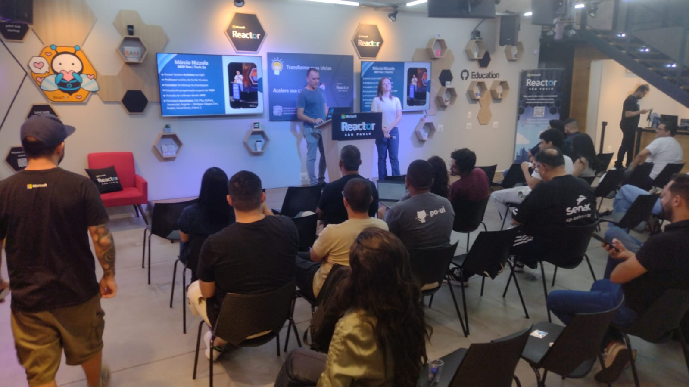

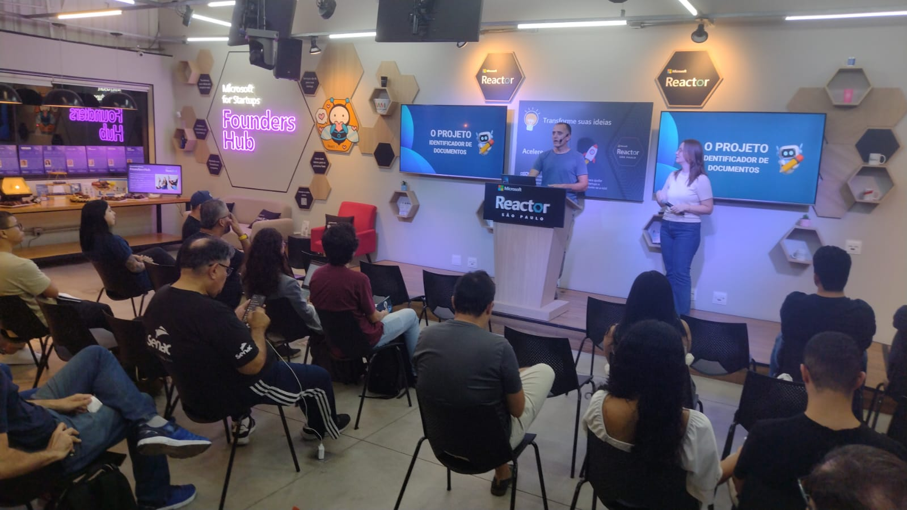

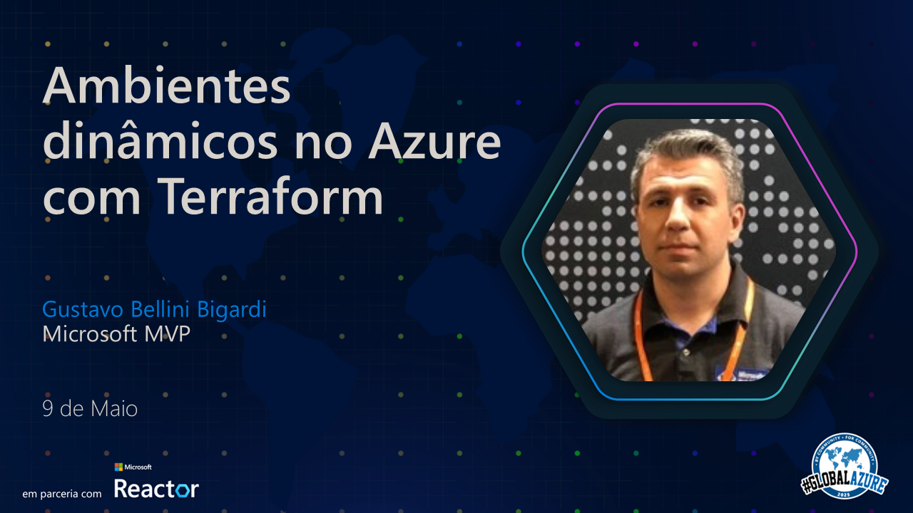

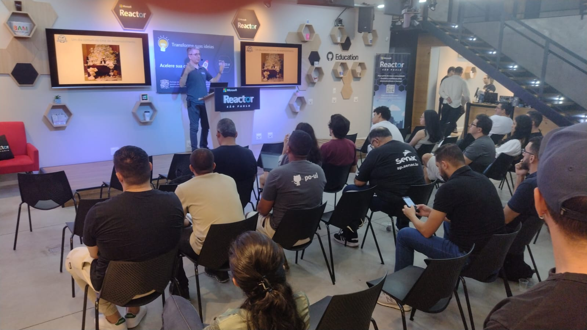

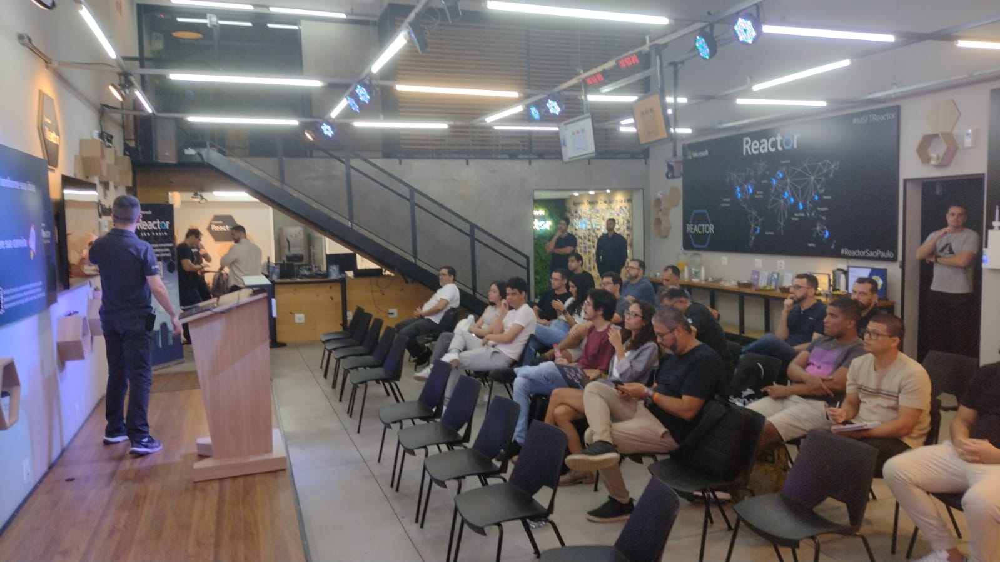

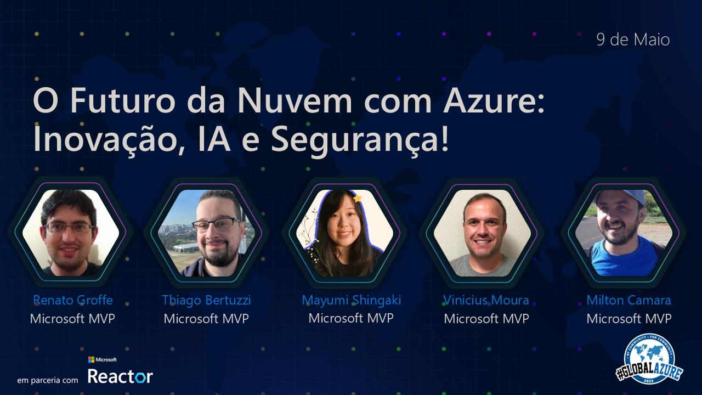

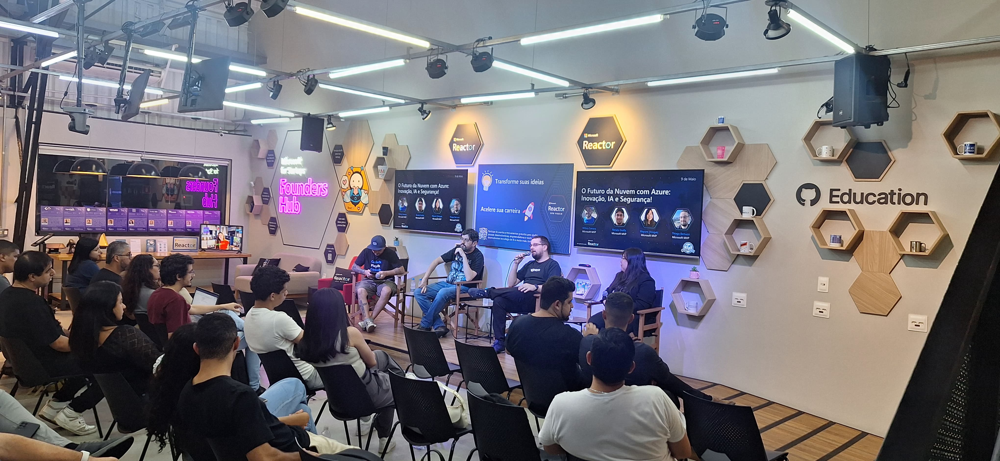

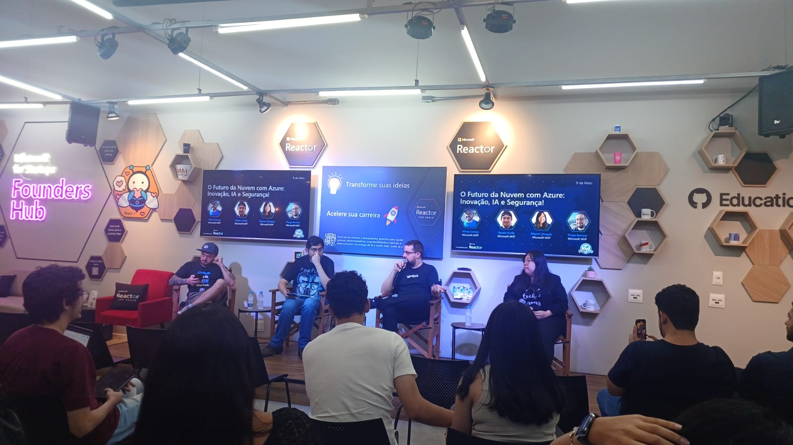